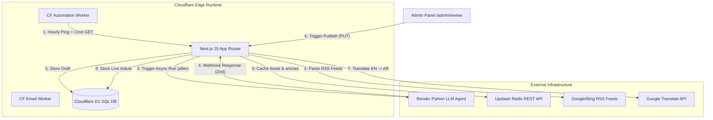

# 🧠 Arabia Khaleej — System Reverse Engineering & Architecture Deep-Dive

This document provides a comprehensive, step-by-step technical breakdown of **Arabia Khaleej**, a bilingual (English & Arabic) regional intelligence portal optimized for high-performance serverless edge deployment using **Next.js 15 (App Router)**, **Cloudflare Workers (nodejs_compat)**, **Cloudflare D1 (SQLite)**, and **Upstash Redis (Cache / Limit)**.

---

## 🏗️ 1. Core Architecture & High-Level Design

Arabia Khaleej is built as a serverless, bilingual publication engine. The high-level component layout is visualized below:



### Why this architecture was chosen:
1. **Serverless Edge (Cloudflare Workers)**: Executing routes at the edge keeps response times sub-millisecond globally, particularly in the GCC region, without maintaining expensive Virtual Machines.
2. **Cloudflare D1 (SQLite at the Edge)**: Cloudflare D1 provides native, zero-latency SQL storage right inside the Edge runtime, resolving key limits and volatile eviction policies.
3. **Upstash REST Redis Cache**: Upstash Redis is used strictly as a fast cache layer for hot articles and feed listings, as well as tracking sliding-window rate limits.
4. **External Render Python Agent**: Running heavy AI and LangChain scripts directly inside Vercel or Cloudflare Edge functions is impossible due to execution size limits and CPU instruction timeouts. Delegating to a dedicated Python instance on Render handles heavy operations. Next.js 15's `after()` handles triggers asynchronously, avoiding blocking timeouts.

---

## 🛢️ 2. Database Schema (D1 SQL) & Redis Cache

Arabia Khaleej utilizes Cloudflare D1 as its primary relational store.

### D1 SQLite Table Structures

#### 1. `articles` Table
Stores published bilingual article details.
```sql
CREATE TABLE articles (
    id TEXT PRIMARY KEY,
    slug TEXT UNIQUE NOT NULL,
    title_en TEXT NOT NULL,
    title_ar TEXT NOT NULL,
    description_en TEXT NOT NULL,
    description_ar TEXT NOT NULL,
    pubDate TEXT NOT NULL,
    source TEXT NOT NULL,
    category TEXT NOT NULL,
    image TEXT,
    tags TEXT, -- JSON array of strings
    author_id TEXT,
    author_name_en TEXT,
    author_name_ar TEXT,
    author_role_en TEXT,
    author_role_ar TEXT,
    content_en TEXT NOT NULL,
    content_ar TEXT NOT NULL,
    wordCount INTEGER NOT NULL DEFAULT 0
);
```

#### 2. `drafts` Table
Manages active draft reviews.
```sql
CREATE TABLE drafts (
    topic TEXT PRIMARY KEY,
    status TEXT NOT NULL,
    word_count INTEGER,
    content TEXT,
    image_url TEXT,
    error TEXT,
    description TEXT,
    tags TEXT, -- JSON array
    timestamp INTEGER NOT NULL
);
```

### Redis Key Schema (Cache & Rate Limits)
Upstash Redis acts purely as a transient cache layer and rate limiter:

| Key Template | Type | TTL / Retention | Purpose |
|---|---|---|---|
| `insights:article:{slug}` | String (GZipped JSON) | Indefinite (Permanent Cache) | Cache of full bilingual published article content |
| `insights:list:en` | List (GZipped JSON) | Indefinite (Permanent Cache) | Cache of ordered English feed summaries |
| `insights:list:ar` | List (GZipped JSON) | Indefinite (Permanent Cache) | Cache of ordered Arabic feed summaries |
| `ratelimit:{route}:{ip}` | Integer | 60s to 3600s | Sliding window rate limiting count |
| `lock:insights:list` | String | 15s | Mutex lock for cache feed updates |

---

## 🔄 3. Step-by-Step Workflows

### Flow A: Automated Daily Article Generation (Cron Trigger)

1. **Cron Dispatch**: Cloudflare cron Worker hits Next.js `/api/cron/generate` with a Bearer header.
2. **RSS Parsing & Deduplication**: Fetches RSS feeds and runs Jaccard Similarity deduplication against existing topics (rejecting any with $\ge 60\%$ word vocabulary match).
3. **Draft Initialization**: Writes draft entry to database with status: `generating`.
4. **Non-Blocking Trigger (`after()`)**: Next.js uses stable `after()` to trigger the Render Python Agent in the background, immediately responding with `220 Accepted` to the worker cron, avoiding execution timeouts.

---

### Flow B: Webhook Callback Processing

1. **Callback Payload**: Render agent completes compilation and sends POST webhook with results.
2. **Zod Validation**: Validates payload schema.
3. **Atomic Update**: Performs an idempotent update check (in SQL or Redis EVAL Lua) to guarantee updates only apply if the draft's current status is `'generating'`, shielding user-made edits from late retries.

---

### Flow C: Admin Editing & Publication

1. **Manual Edit**: Admin edits article content bilingually from the `/admin/review` panel (supporting Write, Preview, and Split Screen render views).
2. **Bilingual Translation**: Calls `translateMarkdown` utilizing space-insensitive regex to protect code block tokens from being corrupted by translation engines.
3. **Save live**: Commits full bilingual record to the SQL database (or Redis list indexes under a mutex lock).
4. **Dynamic Polling**: Dashboard checks database status at a 2-minute interval with tab-visibility and 5-minute idle tracking, or executes immediate fetches via the header **Refresh** button.

---

© 2026 Arabia Khaleej. All rights reserved.
