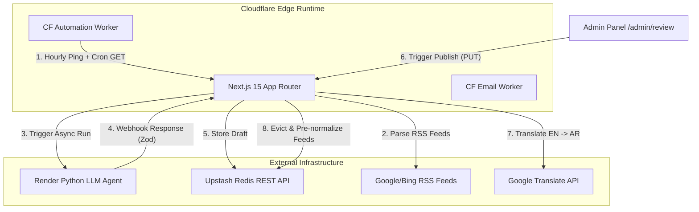
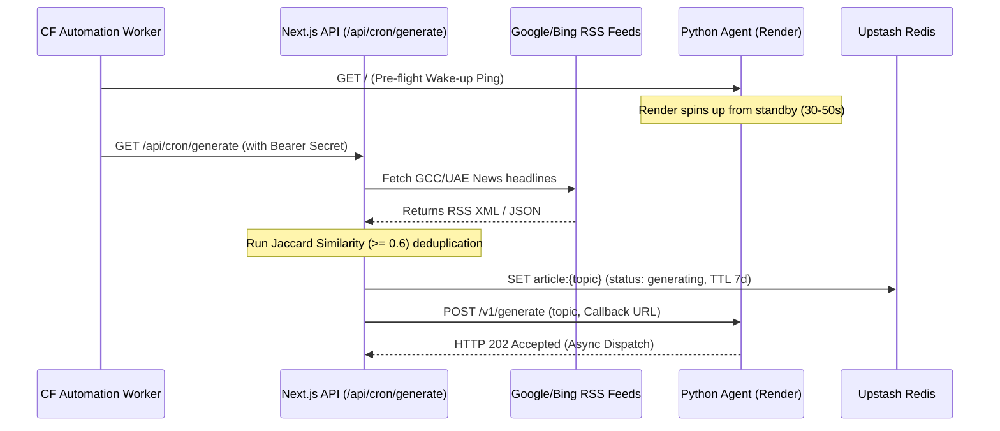
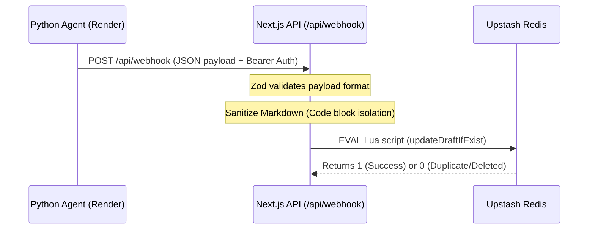
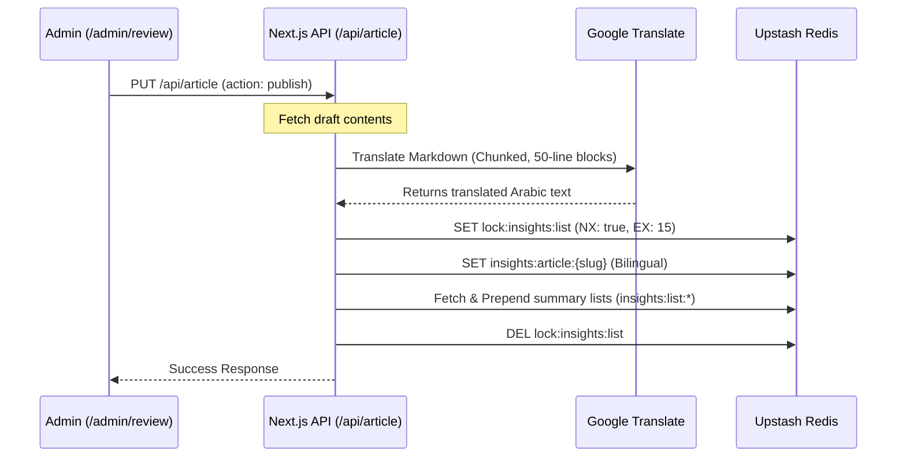
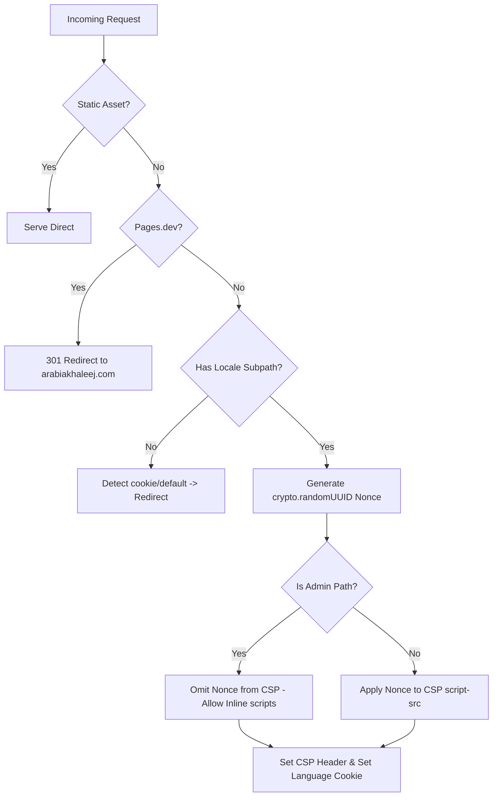

# 🧠 Arabia Khaleej — System Reverse Engineering & Architecture Deep-Dive

This document provides a comprehensive, step-by-step technical breakdown of **Arabia Khaleej**, a bilingual (English & Arabic) regional intelligence portal optimized for high-performance serverless edge deployment using **Next.js 15 (App Router)**, **Cloudflare Pages**, **Cloudflare Workers**, and **Upstash Redis**.

---

## 🏗️ 1. Core Architecture & High-Level Design

Arabia Khaleej is built as a serverless, bilingual publication engine. The high-level component layout is visualized below:



### Why this architecture was chosen:
1. **Serverless Edge (Cloudflare Pages)**: Executing routes at the edge keeps response times sub-millisecond globally, particularly in the GCC region, without maintaining expensive Virtual Machines.
2. **Upstash REST Redis**: Cloudflare Pages/Workers do not support standard TCP sockets natively without premium connections. Upstash’s REST HTTP API permits stateless query resolution over HTTPS, which fits edge routing.
3. **External Render Python Agent**: Running heavy AI and LangChain scripts directly inside Vercel or Cloudflare Edge functions is impossible due to execution size limits and CPU instruction timeouts (10ms on Cloudflare Free Tier). Delegating to a dedicated Python instance on Render handles heavy operations.

---

## 🛢️ 2. Redis Schema & Eviction Policy

Persistent and transient data are unified in Upstash Redis. Because of the **Upstash Free Tier limit of 10,000 keys**, the platform enforces strict TTL limits and automatic database compression.

### Redis Key Layout
| Key Template | Type | TTL / Retention | Purpose |
|---|---|---|---|
| `article:{topic}` | String (JSON) | Varies (see below) | Staging draft queue entry |
| `insights:article:{slug}` | String (GZipped JSON) | Indefinite (Permanent) | Full bilingual published article content |
| `insights:list:en` | List (GZipped JSON) | Indefinite (Permanent) | Ordered list of English summaries (no content body) |
| `insights:list:ar` | List (GZipped JSON) | Indefinite (Permanent) | Ordered list of Arabic summaries (no content body) |
| `ratelimit:{route}:{ip}` | Integer | 60s to 3600s | Sliding window rate limiting count |
| `lock:insights:list` | String | 15s | Mutex lock for feed updates |

### Draft State Machine & Expirations
- **`generating`**: Created when Next.js dispatches a topic to the agent.
  - *TTL*: 7 Days (`60 * 60 * 24 * 7` seconds).
  - *Why*: Gives ample time for agent retries, but automatically purges stuck tasks to save database quota.
- **`error`**: Set if the agent rejects the topic or returns an HTTP failure.
  - *TTL*: 2 Days (`60 * 60 * 24 * 2` seconds).
  - *Why*: Retains failure logs for admin inspection without indefinitely cluttering the dashboard.
- **`pending_review`**: Received successfully from the Python agent webhook.
  - *TTL*: None (Permanent until published or explicitly deleted by admin).
- **`published`**: Final stage when the admin reviews, translates, and deploys.
  - *TTL*: None (Permanent).

### ⚡ Custom Compression & Eviction
- **Compression (via `fflate`)**:
  - *Strategy*: If any JSON payload (e.g. detailed article or listing array) exceeds **1024 bytes**, the app GZips the payload and prefixes the string with `compressed:`, then stores it as a Base64 string in Redis.
  - *Why*: Reduces Upstash bandwidth consumption, cuts down network latency on edge fetches, and stays well within memory caps.
- **Dynamic Eviction**:
  - *Condition*: Eviction triggers if the total database keys size (`dbsize()`) is `>= 9,500` keys (close to the 10k Upstash limit) or either main listing array length exceeds `3,000` articles.
  - *Action*: Atomically slices off the oldest 10 articles by deleting their detailed keys (`insights:article:{slug}`) and removing them from `insights:list:en` and `insights:list:ar` arrays.

---

## 🔄 3. Step-by-Step Workflows

### Flow A: Automated Daily Article Generation (Cron Trigger)



1. **Pre-flight Wakeup**:
   - *Why*: Render’s Free Tier spins down the Python web server after 15 minutes of inactivity. A cold boot takes 30-50 seconds. Since Next.js Edge functions enforce a strict **25-second execution limit**, calling the agent directly inside Next.js would cause a `504 Gateway Timeout`.
   - *How*: The Cloudflare scheduled Worker fires a wake-up ping, using its generous **15-minute** script timeout limit to absorb the cold boot latency. Once warm, it invokes the Next.js endpoint.
2. **Multi-Strategy RSS Parsing**:
   - *Strategy 1*: Google News RSS via `rss2json.com` proxy (bypasses Google's aggressive blocking of serverless/datacenter IP address blocks).
   - *Strategy 2*: Direct Google News RSS fetch utilizing custom browser headers.
   - *Strategy 3 (Fallback)*: Direct Bing News RSS fetch (`https://www.bing.com/news/search?q=UAE&format=rss`), which never blocks edge runtime IPs.
3. **Jaccard Similarity Deduplication**:
   - Compares candidate headlines against recent articles and active drafts.
   - *Formula*:
     $$\text{Similarity}(A, B) = \frac{|A \cap B|}{|A \cup B|}$$
   - Any topic sharing $\ge 60\%$ word vocabulary is rejected as a duplicate.
4. **Dispatch**: Dispatches the topic via HTTP POST to the agent, creating a `generating` draft in Redis.

---

### Flow B: Webhook Callback Processing



1. **Zod Validation**:
   - Enforces a strict schema: `topic`, `status` (`success` | `error` | `discarded`), `article`, `word_count`, `image_url`, `description`, and `tags`.
2. **Idempotence Protection (Lua transaction)**:
   - *Why*: Webhooks might be retried due to temporary network blips. If an admin has already begun editing or has deleted a draft, we must not overwrite their work with a late webhook.
   - *How*: Runs a Lua EVAL script in Redis:
     ```lua
     -- Why: Guarantees atomicity: updates only if status is currently "generating"
     local val = redis.call('GET', KEYS[1])
     if val == false then return 0 end
     if string.find(val, '"status":"generating"') then
       redis.call('SET', KEYS[1], ARGV[1])
       return 1
     end
     return 0
     ```

---

### Flow C: Admin Editing & Publication



1. **Translation Shielding**:
   - Isolates code blocks using `[CODE_BLOCK_X]` placeholders before calling Google Translate. This prevents code blocks or syntax from being translated and corrupted.
2. **Request Chunking**:
   - *Why*: Google Translate fails if the string is too large, and translating line-by-line takes 100+ requests, triggering Cloudflare CPU 10ms execution limits.
   - *How*: Groups lines into ~3000 character blocks (max 50 lines), translating blocks in batch to keep edge execution times well under limits.
3. **Pre-Normalization**:
   - Publishes the full bilingual record to `insights:article:{slug}`.
   - Normalizes separate English and Arabic variants, strips the heavy `content` key to conserve feed listing space, and prepends them to the index feeds (`insights:list:en`, `insights:list:ar`).
4. **Concurrency Safety**:
   - Uses a Redis lock (`lock:insights:list`) with a 15-second expiration to prevent write conflicts if multiple admins publish articles simultaneously.

---

## 🔒 4. Security & Middleware Configuration

Security is managed globally inside [middleware.ts](file:///c:/Users/asish/Arabia%20Khaleej/middleware.ts):



### Cryptographic Nonces for Content Security Policy (CSP)
- The middleware generates a new base64 cryptographically secure token using `crypto.randomUUID()` on every page request.
- The nonce is placed in:
  1. The response `Content-Security-Policy` header.
  2. The custom request header `x-nonce` (allowing React Server Components to retrieve it via `headers()` and attach it to `<Script>` elements).
- **The Admin Exception**:
  - Next.js pre-compiles and optimizes static pages (like the admin review dashboard) at build-time.
  - Since static pages carry static inline scripts generated at build time, they cannot contain a dynamic request-time nonce. Under the CSP specification, the presence of any nonce blocks all `unsafe-inline` scripts.
  - To prevent a black screen crash on admin pages, the middleware omits the nonce from the CSP header when a path starts with `/admin`, letting the browser safely execute the pre-rendered Next.js hydration scripts.

---

## 📂 5. Directory Map

Key files and their roles in the codebase:

```
├── app/
│   ├── [lang]/
│   │   ├── page.tsx               # Server-rendered Landing Page
│   │   ├── layout.tsx             # Bilingual HTML wrapper, Fonts, & Providers
│   │   ├── prayer/                # Location-based Prayer Times Page
│   │   └── currency-exchange/     # Exchange rate calculator UI
│   ├── admin/
│   │   └── review/                # Admin Panel (draft review queue)
│   ├── api/
│   │   ├── article/               # Draft CRUD & Publish logic
│   │   ├── cron/generate/         # Automated news selector & agent trigger
│   │   ├── webhook/               # Agent response handler
│   │   └── prayer-times/          # AlAdhan API Proxy
│   ├── sitemap.ts                 # Edge-rendered Dynamic XML Sitemap
│   └── middleware.ts              # Security, i18n redirects, and CSP Nonces
├── components/
│   ├── layout/                    # Header, Providers, & Theme configurations
│   ├── prayer/                    # Prayer schedule calculators
│   └── seo/                       # Structured Schema injections (FAQ, Website)
├── lib/
│   ├── redis.ts                   # Edge-safe Redis client + Gzip helpers
│   ├── redis-node.ts              # Standalone ioredis client (Node targets only)
│   ├── insights.ts                # SOLID Data Access Layer (Repository/Service)
│   ├── translate.ts               # Code-shielded Translate proxy
│   └── seo.ts                     # Metadata & Canonical builders
└── worker/
    ├── daily-automation.js        # Scheduled Hourly Cron Worker
    └── worker.js                  # Contact Form Email Worker (SEND_EMAIL binding)
```

---

## 📊 6. SOLID Refactoring in `lib/insights.ts`

The data access layer follows clean, object-oriented SOLID principles:

1. **Single Responsibility Principle (SRP)**:
   - `RedisInsightRepository`: Responsible *only* for raw database interaction.
   - `StandardInsightValidator`: Responsible *only* for parsing structures and verifying validity.
   - `SortByDateDescendingProcessor`: Responsible *only* for arranging arrays.
2. **Open/Closed Principle (OCP)**:
   - New filters (like geotargeting or keyword blocks) are written by implementing the `IInsightProcessor` interface and adding them to the pipeline, without modifying the base service code.
3. **Liskov Substitution Principle (LSP)**:
   - Any class implementing `IInsightProcessor` (e.g. `DeduplicateProcessor`, `CategoryFilterProcessor`) can replace any other within the pipeline without breaking the runtime logic.
4. **Interface Segregation Principle (ISP)**:
   - Splitting validation (`IInsightValidator`), storage (`IInsightRepository`), and arrays processing (`IInsightProcessor`) into narrow interfaces prevents classes from depending on methods they do not use.
5. **Dependency Inversion Principle (DIP)**:
   - High-level orchestrators (`InsightService`) depend on abstract interfaces (`IInsightRepository`, `IInsightValidator`) instead of hardcoded imports, allowing mock storage to be injected during tests.
